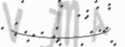
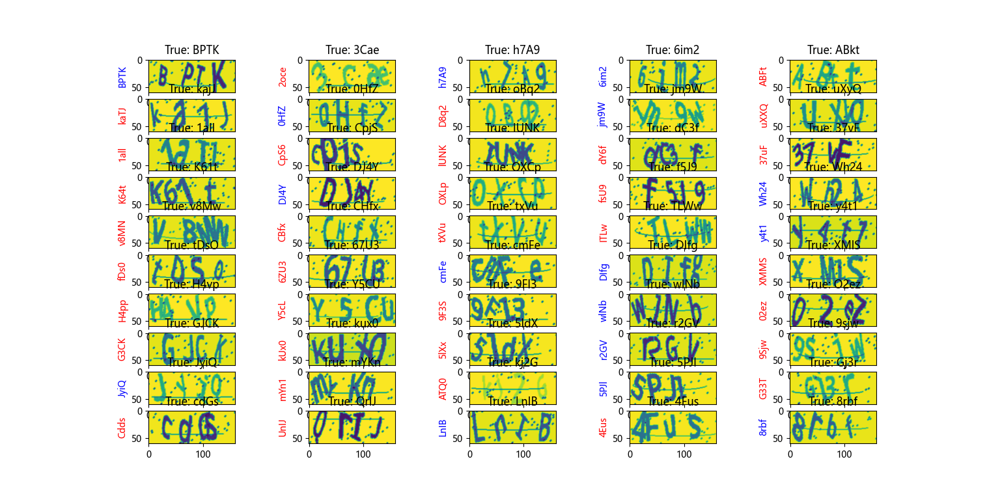
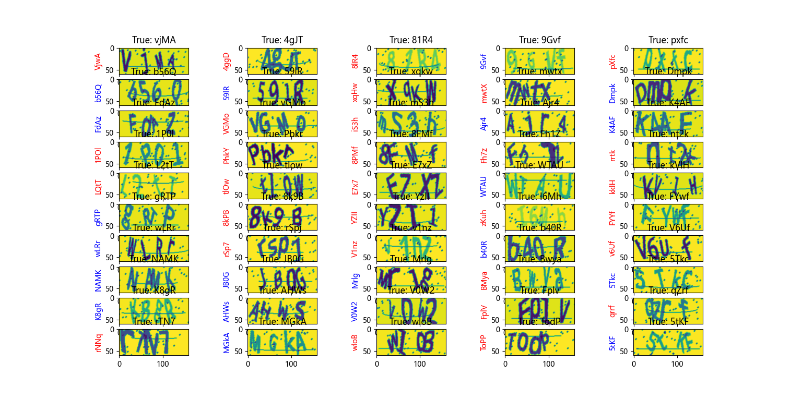

# Captcha_Tensorflow

## Package
```python
import os
import random

from PIL import Image
from captcha.image import ImageCaptcha
from concurrent.futures import ThreadPoolExecutor

import numpy as np
import tensorflow as tf
import matplotlib.pyplot as plt
```
## Captcha

RGB Captcha
> shape ( 60, 160, 3)


Gray Captcha
> shape ( 60, 160)




## Predict Result
RGB accuracy: 77.50%



Gray accuracy: 79.90%

